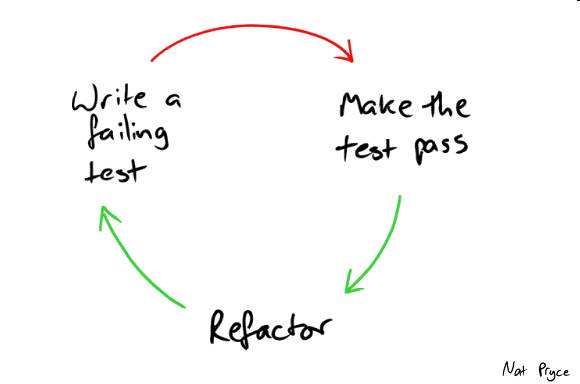

Hasta hace unos 2 años nunca había escrito un test en mi vida, si escuchaste bien, me avergüenza decirlo pero en mis primeros 3 años en la industria nunca nadie me pidió que escribiera un test.

No sabía cómo se hacían, y sin duda no entendía los beneficios que estos podían traer, conocía la teoría y entendía porque podían ser útiles pero ingenuamente los consideraba no tan importantes.
Fue entonces cuando leí "Clean Code" y "The Clean Coder" [Robert C. Martin] que una culpa se apoderó de mi. Me di cuenta que durante todo este tiempo nunca había presentado una prueba repetible de que mis programas funcionasen, andaban por plena suerte y solo habían sido probados por mi en ciertas situaciones.

Me di cuenta que había sido irresponsable de mi parte entregar un producto de esta manera y que no tomar esto enserio era una falta de respeto hacia el arte que tanto aprecio y que le da de comer a mi familia.
Recordé muchas veces en las que errores aparecen y reaparecen en partes del código que ya están terminadas, como un cambio trae devuelta toneladas de errores que ya habían sido testeados.
Entendí el miedo real que sentía al momento de refactorizar una parte del código temiendo que podía salir de esa bolsa.

---

Fue entonces cuando decidí tomar un cambio de postura, así como Michael Feathers define el código legacy como cualquier código que no tenga tests, decidí que cada pieza de código que saliera de mi computadora, iba a tenerlos. Que un desarrollo no estaba terminado si este no tenía una suite de tests que lo acompañe que demuestre su correcto funcionamiento (o al menos que pruebe que no es incorrecto). Desde entonces luego de que mi código funcionase, procedía a escribir tests, toneladas de ellos cubriendo todos los grandes funcionamientos, si un bug aparecía, lo arreglaba y escribía un test para ello. Si bien puedo decir orgullosamente que mi código y autoestima como desarrollador mejoro, mi miedo no se redujo.

Seguía teniendo un miedo ferviente a la hora de cambiar código, el hecho de tener suites de tests completas por alguna razón no me daban seguridad, lo que es peor, al darme cuenta que encontraba tests unitarios que pasaban por otras razones que las esperadas, cuestione si todo este trabajo valía la pena o solo me estaba engañando.

Fue entonces cuando lei Test Driven Development By Example [Kent Beck], y mi mente se abrió a una nueva posibilidad. La idea de que el orden en el que realizaba el proceso de desarrollo si importaba, que escribir mis tests primero si podría tener cierto beneficio.

---

Un poco de contexto:

TDD es un método para dejar que tus tests guíen el diseño de tu software, de seguir este proceso tu código se volverá Desacoplado y Testeable. Usualmente cuando queremos desarrollar algo nuevo nos metemos directamente a teclear y tratamos de sacar algo funcionando y luego escribimos un test para "probar" que funciona, en TDD arrancamos al revés.

1. Decimos, ¿que queremos que este código haga?¿en que situación no debería andar? y escribimos nuestro primer escenario de test, el test naturalmente va a fallar ya que no existe todavía una implementación.
2. Luego procedemos a hacer lo mínimo e indispensable para que el test pase y se nos muestre la deseada luz verde.
3. Finalmente refactorizamos el código siempre corriendo nuestro test después de cada cambio.

> Este ciclo básico se conoce como Red Green Refactor o Rojo Verde Reorganizar.

Ahora que entendemos el proceso básico veamos esos momentos en los que me enamoré:

** Amor a primera vista **

Básicamente por seguir este método nosotros comenzamos siempre con un escenario que sabemos que no funciona y logramos hacerlo funcionar, esto presenta el primer beneficio que amo de TDD, ** CONFIANZA **

Cuando vos viste fallar tu código y luego al realizar los cambios correspondientes lo ves pasar, esto te da plena confianza de que tu implementation hace lo que vos esperas que haga, es una diferencia sutil pero que notas inmediatamente al momento de hacer un gran Refactor, tu suite de test te genera tal confianza que sabes que si rompes algo, los tests te lo van a informar.

** Segunda cita **

Usualmente al desarrollar una nueva tarea, tienes que modificar código preexistente, cambias numerosas cosas y luego llega a una parte del proceso en que algo que se encontraba funcionando, ya no lo hace mas, lo peor es que nunca sabemos exactamente qué cambio o en qué momento eso dejo de andar, pasas mucho tiempo buscando ese cambio equivocado e incluso a veces terminas volviendo todos tus cambios atrás y comenzando de cero.
Es en esta situación cuando se me presentó otro beneficio de TDD, ** ERRORES DE CORTO PLAZO**. Al encontrarse constantemente en un proceso de Red Green Refactor, en el que escribes tests y estos guían la implementación de tu solución, es un proceso rápido en el que los cambios se hacen en pequeños incrementos, hasta hace solo unos cambios, el código daba Verde y ahora da Rojo, entonces se vuelve trivial el encontrar que parte fue la que causó el error, ya que solo tienes que recordar los cambios que hiciste hace unos pocos segundos.

** Tercera cita **

Cuando pase por esa etapa en la que escribía los tests después, muchas veces se presentaba un error que provocaba que mi confianza en la suite de tests bajase, con el paso del tiempo note que esto sucedía debido a que los tests se encontraban mal planteados desde el comienzo, al escribir los tests después del código inconscientemente estos unicamente pasaban por los "Caminos Fáciles", lugares felices del código donde todo funciona, o lo hace la mayoría del tiempo, esta situación me dio otro beneficio de TDD, ** PENSAR EN CASOS EXTREMOS **.

TDD te obliga primero a pensar en los tests, esto hace que puedas concentrarte en cómo debería funcionar tu programa, y también cómo no debería hacerlo, al utilizar el testing como prueba comprobable es mucho más sencillo pensar en estos casos extremos en los que el código tiene que comportarse de maneras específicas, nuestra mente trata de buscar esos lugares y verlos dar Verde.

** Mudándonos juntos **

Por último, y este se encuentra relacionado al anterior. Cuando empecé a realizar los tests luego de la implementation, mi tarea como desarrollador se volvió tediosa y aburrida, por momentos maldije el sentir esa responsabilidad de testear mi código, este aburrimiento provocó que deje de testear caminos complicados o ignore ciertos casos específicos en mi desarrollo. TDD llegó al rescate para solucionar ese problema, hacer los tests primero y verlos fallar género en mi una adicción, la adicción de encontrar errores y luego corregirlos, saber con certeza que esos errores no volverían a aparecer (al menos no de la misma manera) y fue aquí que se me presentó el último beneficio, TDD hizo que ** EL TESTING SEA DIVERTIDO **.

---

Desde entonces no imagino mi vida sin escribir tests, hoy en dia a la hora de reproducir un bug muchas veces creo un test que lo pruebe incluso antes de probarlo manualmente,
esta adicción me ha llevado incluso a crear una extension para VSCODE para correr unit tests de Angular con mayor facilidad y poder aplicar el famoso ciclo con rapidez.

Espero que luego de leer este artículo te encuentres interesado en darle una oportunidad a TDD, es un camino difícil y toma tiempo transitarlo, por momentos nuestros impulsos nos llevan a seguir desarrollando más de la cuenta cuando deberías estar escribiendo el test, pero con practica este camino se vuelve más fácil y los beneficios más evidentes.

Que decís, ¿te animas a recorrer este camino conmigo?.
