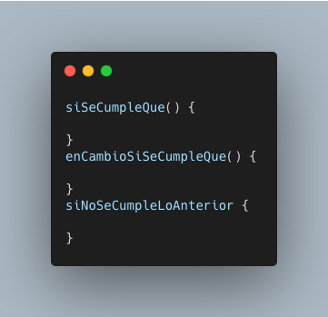

Después de años trabajando como desarrollador, sigo sorprendido de la falta de contenido de calidad específico para nuestra comunidad.
Pasamos días enteros trabajando en Inglés, leyendo documentation, usando tutoriales, hasta nuestro lenguajes de programación están en Inglés.
Se imaginan si un if fuese así?

No fue hasta hace unos meses cuando empecé a realmente valorar la suerte que tengo de saber inglés, no solo porque puedo entender las herramientas, cursos, documentación,
sino porque puedo trabajar perfectamente con gente de muchas nacionalidades, buscar ayuda y aprender. Darme cuenta de esto también me hizo darme cuenta que hay gente que no es tan afortunada,
programadores que no poseen un nivel de inglés suficiente para entender un libro, esto también les dificulta encontrar problemas a errores comunes en portales como Stack Overflow.

Decidí entonces que iba a hacer un esfuerzo para aportar mi parte y que la comunidad de programadores hispanos crezca, desde ahora en más todos los artículos de mi blog van a ser en español, voy a publicar un artículo todos los viernes, últimamente ando enfocado en programación funcional y arquitectura de software, si esto te gusta entonces te doy la bienvenida a mi calabozo.
