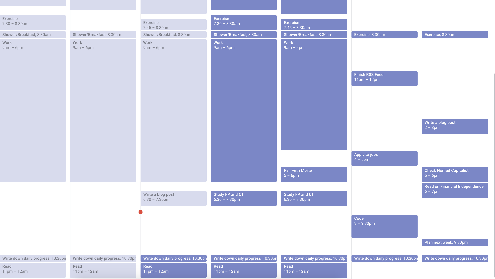

Tal vez notaste algo extraño en los últimos días, ¿no hay un nuevo artículo de Patricio?

## El punto de partida

Bueno, como saben hace unas semanas, escribí un artículo sobre el uso de la cuarentena para mejorar, en caso de que quieran leerlo, pueden hacerlo [aquí](https://www.patferraggi.dev/blog/2020/mar/quarantine-improve/). En aquel entonces estaba en llamas, tenía todo planeado, meditaba todas las mañanas, hacía ejercicio todas las mañanas, programaba todos los días (aparte de las 8 horas de Programación como trabajo), leía y escribía varios artículos a la semana. Pero luego cometí algunos errores...

## El fondo

Aunque era un jugador ávido cuando era más joven, desde que comencé a programar hace unos años, he estado jugando cada vez menos, en realidad, lo que sucede es que creo que escribir y aprender sobre software es más divertido que jugar, un hecho bastante controvertido estoy seguro. Eso no quiere decir que no juego en absoluto, generalmente juego alrededor de 3 juegos al año, el año pasado fue _Read Dead Redemption 2_ y _God of war_ con un poco aquí y allá de _Kingdom Come: Deliverance_. Pero este año, no había ningún juego a la vista para mí, al menos hasta que se publique _Cyberpunk 2077_ en septiembre.

## ¿Que pasó?

He estado viviendo en Bélgica durante dos años, tener pocas conexiones aquí me ha hecho muy fácil concentrarme en lo que es más importante para mí:

- Mejorar como desarrollador
- Ser un buen esposo
- Escribir código abierto
- Crear tutoriales
- Escribir publicaciones en mi blog
- Ponerme en forma
- Leer Filosofía
- Construir un _side hussle_

Pero este fin de semana, estaba hablando con unos amigos de Argentina y me dijeron que si compraba un juego podríamos jugarlo en línea, como en los viejos tiempos. Estuve tentado, no había jugado nada con ellos en años, y extrañaba tener algo de tiempo de descanso, así que compré _Divinity: Original Sin 2_.
Me enganché al instante, me sentí como en los viejos tiempos, pasé de no jugar un solo juego a jugar durante 12 horas, ir a dormir, despertar y seguir jugando, leer sobre \_builds en mi tiempo libre y ver tutoriales, sin ejercicio, sin comida saludable, sin meditación, sin planificación semanal. Sé que estas cosas no están relacionadas entre sí, pero cuando dejé de hacer una, fue muy difícil seguir haciendo las otras.
Toda mi planificación y productividad ser fueron al caño, al principio me sentí culpable, pero luego me di cuenta de dos cosas:

- Lo que está hecho, hecho está, no tiene sentido culparte a ti mismo, pero puedes aprender de ello
- Estaba progresando muy bien con todo lo demás, merecía un poco de juego para relajarme de vez en cuando, con cierta moderación, por supuesto.

También sabía un hecho clave sobre volver a la `normalidad`:

> Todo lo que necesitas es ganar impulso

El impulso es clave, sabía que todo lo que necesitaba para volver al caballo era volver a la planificación, simplemente hacer mi rutina regular durante unos días y luego continuaría como siempre. También es mucho más fácil convencerse cuando solo se está planeando con unos días de anticipación, así que me dije a mí mismo. Bien, intentemos hacerlo hasta el lunes.

¿Así que, cuál es el plan?

## Comenzando de a poco

Un objetivo clave para mí en este asunto fue aprender de él. En lugar de centrarme estrictamente en cosas relacionadas a la programación, quiero darme un descanso de vez en cuando, así que en el futuro, no me estresare y simplemente relajarse como una parte regular de mi rutina. Entonces planeé mi calendario:

¿Te das cuenta de que los primeros 2 días de la semana no hay nada? Me costaba mucho dejar de jugar, no hice ejercicio ni escribi mi progreso. Pero hoy, miércoles, decidí que no era así como quería pasar mi tiempo, me encantan los juegos y voy a seguir jugando, pero también haré otras cosas que disfruto.
Planeé algunas cosas para mi semana, como continuar aprendiendo _Programación funcional y Category theory_, hacer _Pair Programming_ con un amigo y escribir algunos artículos. Si has visto mi artículo original sobre planificación, sabrás que la semana parece bastante vacía de acuerdo con mis estándares habituales, bueno, no quiero esforzarme demasiado, por ahora, quiero seguir jugando de vez en cuando, así que dejé bastantes espacios vacíos para pasar tiempo con mi esposa o jugar con algunos amigos.

Pero la clave fue comenzar de nuevo a hacer cosas, sé que esto suena obvio, pero en realidad, es todo lo que necesitas hacer, lentamente comenzar a hacer cosas de nuevo, algo de ejercicio aquí y allá, un artículo, una línea de código a la vez, hasta que vuelvas a tu rutina.

Así que hoy me desperté, me cambié e hice ejercicio (incluyendo meditación), trabajé durante el día y ahora me ves aquí escribiendo esta publicación de mi blog. Si tengo algo de tiempo después de hacer esto (escribir tanto en español como en inglés toma bastante tiempo), voy a leer algunas páginas de un nuevo libro sobre _Estoicismo_ que recibí hoy y luego continuaré subiendo de nivel a ese invocador/necromancer y disfrutando un juego de rol basado en turnos.

## ¿Ahora que?

En las próximas semanas, planeo comenzar lentamente a aumentar la cantidad de acciones que tomo para lograr mis objetivos, pero siempre recordando que no es una carrera, lo hago porque quiero, y de vez en cuando merezco tiempo para relajarme siguiendo algunas otras pasiones.

Todas las mañanas intentaré recordarme a mí mismo que soy un ser humano, que tengo pasiones y necesidades, pero con lo mejor de mis habilidades intentaré controlar mis emociones y disposiciones, trataré de pensar las cosas y actuar. Si fallo, aprenderé de ello sin sentirme culpable. Si tengo éxito, me recompensaré.

Con suerte, dentro de unos días, tendré el impulso necesario y recibirás un nuevo artículo mio acerca de la _Programación funcional_ &#128512;.
