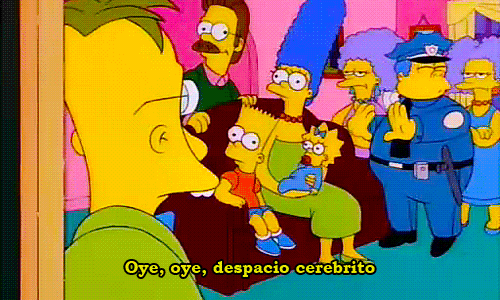

Si venís leyendo mis últimos artículos probablemente sepas que estoy estudiando Programación Funcional y tengo que ser honesto, soy un _Newbie_, y me refiero a un _Newbie_ estilo: menos de level 12, no haciendo PVP, matando monstruos chicos por horas.
Siendo el _Newbie_ que soy, ni bien arranqué me mandé con todo, no dudé en meterme en un Dungeon mucho más alto que mi nivel con monstruos que pueden matarme con pocos golpes, como podés imaginar sigo asustado, pero por suerte lentamente estoy progresando y de a poco mi personaje incrementa su nivel. Espero que con esta serie de tutoriales puedas guiarte por este dungeon evitando las trampas en las que yo ya caí.


---

De acuerdo a los libros de Programación Funcional (desde ahora voy a decir PF para abreviar), la PF encuentra sus raíces en la matemática, si vos sos un programador autodidacta como yo esto puede resultar sumamente intimidante pero luego de que le agarrás la mano se vuelve una sensación reconfortante. Te brinda un trasfondo conceptual muy rico con el que podés “mapear” conceptos para rápidamente saber si estás haciendo las cosas de la manera correcta o no, un beneficio que usualmente no tenemos en la programación orientada a objetos.

Como probablemente ya sepas en la PF todo es acerca de Funciones.


En la programación orientada a objetos (o POO) usualmente diseñamos clases para representar el dominio y creamos métodos para darles comportamientos a esas clases, en la PF en cambio definimos el universo de nuestro programa en términos mucho más sencillos. Creamos Tipos y funciones que manipulan Data y a esos mismos Tipos para producir resultados.
Pero bueno, comencemos desde el principio:

## ¿Qué es una función?

Se lo que estás pensando, ¿de verdad te pensás que no se lo que es una función?. Bueno, yo pensé que sabía y ahora no volveré a mirar una función de la misma manera. La PF define a una función de manera diferente a la mayoría de los lenguajes POO, la define en términos matemáticos. Veamos su definición:

_En Matemática, el concepto general de función, se refiere a una regla que asigna a cada elemento de un primer conjunto un único elemento de un segundo conjunto_


¿Eh?¿Cómo?

Vamos a intentar explicarlo con un ejemplo en JavaScript:

```javascript
function isBiggerThanThree(value) {
  return value > 3
}

isBiggerThanThree(3) // FALSE
isBiggerThanThree(5) // TRUE
```

Esta función es una regla o relación entre los tipos _INT_ y _BOOL_ (si, ya se que los tipos en JavaScript son particularmente raros) donde para cada posible valor del primer set (_INT_) existe únicamente una respuesta posible en el segundo set (_BOOL_).

Debido a esto, cada vez que pasemos a esta función un número mayor a 3, nos va a devolver TRUE. No hay ninguna manera que esto no se cumpla, si esto no se cumpliese entonces no estaríamos haciendo PF, por suerte para nosotros la mayoría de los lenguajes estrictamente funcionales, como Haskell, imponen este comportamiento sobre el programador.

De este concepto sale una palabra mágica que escucho mucho cuando alguien habla sobre la PF, las “Funciones Puras”, me dirás, ¿qué son las funciones puras? Las funciones puras no son más que las funciones regulares en la PF, son funciones que no dependen o modifican el estado afuera de ellas mismas cuando se ejecutan, igual que la función que escribimos hace unos momentos, recibe un parámetro, computa y devuelve un resultado, eso es todo.
Se lo que estás pensando:

### ¿Y esto para qué me sirve?

1. Si una función siempre devuelve el mismo resultado para un mismo parámetro, entonces hacer _unit testing_ se vuelve una tarea extremadamente sencilla
2. Si una función siempre devuelve el mismo resultado para un mismo parámetro, entonces lo resultados pueden ser “cacheados” para mejorar la _performance_, esto se conoce como [Memoization](https://en.wikipedia.org/wiki/Memoization), es un concepto muy común en la PF y muchas librerías incluyen funciones para hacer esto, como por ejemplo [memoizeWith en Ramda.js](https://ramdajs.com/docs/#memoizeWith)
3. Si una función no depende del estado del programa fuera de sí misma entonces nuestro código se vuelve extremadamente efectivo en escenarios donde la concurrencia es moneda corriente.
4. Ya que definimos funciones en términos matemáticos, otros conceptos matemáticos asociados a funciones también se vuelven aplicables a la programación, como es el concepto de [Composición de funciones](https://en.wikipedia.org/wiki/Function_composition)

La PF hace extensivo uso de la composición, se trata fundamentalmente de tomar funciones pequeñas, genéricas y sencillas y combinarlas de distintas maneras para obtener comportamientos complejos.
Devuelta, empecemos con la definición para sacarnos eso del encima:

_Si tenemos dos funciones: f(x) y g(x), de modo que el dominio de la 2ª esté incluido en el recorrido o codominio de la 1ª, se puede definir una nueva función que asocie a cada elemento del dominio de f(x) el valor de g[f(x)]_




Esto significa que si tenemos una función que toma un _INT_ y devuelve un _BOOL_, y tenemos una segunda función que toma un _BOOL_ y devuelve un _STRING_, entonces por definición también tenemos una tercera función que toma un _INT_ y devuelve un _STRING_, debido a la regla de composición de funciones. Veamos un ejemplo:

```javascript
function isBiggerThanThree(value) {
  return value > 3
}

function mapBoolToHumanOutput(value) {
  return value ? "yes" : "no"
}

const result = mapBoolToHumanOutput(isBiggerThanThree(3))
```

En los siguientes blog posts, explicaré otros conceptos adyacentes a este que nos permitirán crear nuevas funciones sin la necesidad de aplicarlas, de modo que podremos pasarlas como parámetros o devolverlas como valores de retorno.

---

Si decidís seguirme en mi camino me aseguraré de que juntos completemos este calabozo, llegaremos a un punto en el que conoceremos todos sus rincones, tendremos todas las armas y secretos y seremos capaces de salvar el progreso una vez todo esté completo.

Realmente espero que te haya gustado esta pequeña introducción, continuaré subiendo de nivel y guiándote en el proceso. Si encontraste este post útil te pido por favor que me lo hagas saber en los comentarios, mismo si tienes alguna duda, corrección o recomendación no dudes en hacérmelo saber. &#128512;

Finalmente voy a dejar una pequeña lista del material que voy a estar usando en esta travesía. Actualmente, estoy aprendiendo Haskell pero esto es solo una herramienta más para aprender Programación Funcional.

- Estoy haciendo este curso gratis en vivo dictado por profesores de MIT: [Programming with categories](http://brendanfong.com/programmingcats.html), es sobre _Category Theory_ y Programación Funcional en Haskell.
- También me encuentro leyendo un libro de uno de los profesores del curso: [Category theory for programmers](https://github.com/hmemcpy/milewski-ctfp-pdf)
- Una vez completado eso, tengo varios caminos posibles dependiendo de la _Build_ que haga para mi personaje

#### HASKELL BUILD

Podría seguir aprendiendo Haskell con [Learn you a Haskell for great good](http://learnyouahaskell.com/chapters) o [Haskell from principles](https://haskellbook.com/) o [A type of programming](https://atypeofprogramming.com/).

#### CLOJURE BUILD

Podría cambiar a algo como Clojure con [Structure and Interpretation of Computer Programs](https://web.mit.edu/alexmv/6.037/sicp.pdf) o el libro que le da nombre a esta serie de artículos [Functional programming for the object-oriented programmer](https://leanpub.com/fp-oo)

#### JAVASCRIPT BUILD

Por ultimo también podría cambiar a JavaScript ya que lo uso en mi dia a dia en el trabajo, para esto leería [Mostly adequate guide to functional programming](https://github.com/MostlyAdequate/mostly-adequate-guide) y podría experimentar con RX.JS o Ramda.JS

Todavía no es claro como se verá mi personaje cuando llegue a nivel máximo, lo que sí es claro es que me asegurare de narrar mi aventura y compartir todo el conocimiento que adquiera en el proceso.
