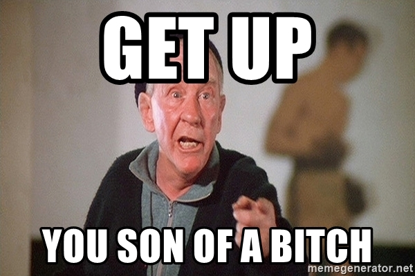

Hola chicos, ¿cómo han estado? Ha pasado casi un mes desde mi último artículo y debo decir que he estado luchando por concentrarme. Creo firmemente en el autoanálisis y la mejora continua, pero últimamente no he estado en la cima de mi juego.

Esta próxima publicación será un poco extraña, no es lo que suelo publicar. En lugar de dirigir el contenido en una determinada dirección, esta será una conversación conmigo mismo, tratando de hacerme recordar cuáles son mis valores y por qué hago las cosas que hago. Aún así, espero que vean algunas cosas en ustedes mismos y obtengan algo positivo, incluso si solo es para darse cuenta de que todos pasamos por problemas y falta de motivación.

---

Todos los días nos despertamos y decimos, hoy es el día, hoy seremos mejores, haremos ejercicio, comeremos sanamente, aprenderemos, y cada día pasa y se consume un día más.
Nos quedamos en la cama porque nos sentimos cómodos allí, debajo de las sábanas el mundo es más agradable. Sin responsabilidades, sin obstáculos en nuestro camino, sin gente mala, pero tambien sin alegría, sin satisfacción.

¿Te trajeron a este mundo para sentirte cómodo? quedarte en la cama y dejar pasar el tiempo? Recuerda que el tiempo es precioso, siempre lo supiste. `Memento Mori`, recuerda que eres mortal. No hay evidencia clara que muestre que hay algo más después de esto, probablemente esta es la única vida que tendras.

Y sé que la vida no ha sido fácil, pero tampoco ha sido tan mala. No eres el tipo de luchador que se rinde después de algunos golpes. Nariz rota, mandíbula rota, mano rota, y todavía estamos aquí lanzando golpes, si eso no funciona siempre podemos hacer clinch 😉. Sé honesto contigo mismo, ¿realmente la vida te está knockeando o simplemente te estás rindiendo? no hay nada que te impida alcanzar tus objetivos, ser la persona que quieres ser. Excepto tal vez vos mismo.

¿Cuál es el punto de quejarse?

Recuerda, hay dos tipos de cosas en la vida, las cosas que puedes controlar y las cosas que no puedes controlar. Si no puedes controlarlo, entonces no tiene sentido preocuparse por ello, porque no hay nada que puedas hacer al respecto.
Si, por otro lado, el problema está bajo tu control, ¿con quién te quejás? tienes la solución en tus manos, deja de quejarte y vuelve al trabajo.

¿Por qué malgastas el esfuerzo mental en pensar en lo que sucederá en el futuro?

Revisa tus objetivos. ¿Podría ser que estás poniendo demasiadas expectativas en los resultados? ¿Son realmente tan importantes los resultados? Es mejor medir el éxito por las acciones que realizas, por cómo te comportàs en función de tu propio conjunto de valores. Sabes qué es lo correcto, deja de preocuparte por lo que la gente pueda pensar y comienza a concentrarte en no deshonrarte y vivir a tu máximo potencial.

Esto no es un reproche, has hecho cosas buenas, has estado muy concentrado antes y tienes la autoestima necesaria para rendir al máximo de tus habilidades. El pasado es pasado, no tiene sentido culparte por los errores cometidos. En este mismo momento, puedes mejorar, ser mejor que ayer.
El hombre sabio vive sin remordimientos porque cada acción que toma se realiza mediante el uso de la razón, no espera nada y nada le sorprende. En este mismo momento, las virtudes son accesibles para ti como lo son para todos los seres humanos.

No intentes ser perfecto, solo trata de ser mejor cada día y deja que el futuro se cuide solo. Fracasarás en el futuro, volverá a suceder, lo prometo. No tiene sentido reiniciar desde cero cada vez que esto sucede. Como lo hacemos en el desarrollo de software, iteremos en nuestra vida, nuestras decisiones y nuestras virtudes.
Prueba, refactorización, mejora.

¿Vale la pena estar enojado?
A lo largo de la vida, conocerás personas que son groseras, egoístas y desleales, pero recuerda que las personas no son malas por naturaleza, simplemente no conocen nada mejor. Todos intentan hacer lo mejor que pueden con la información que tienen a la mano. ¿Es justo enojarse con las personas 'malas' cuando eres uno de ellos?

La vida humana es lidiar con el conflicto, sucederán muchas cosas hasta tu último aliento, en lugar de perder esos preciosos segundos en enojarte, mejor sonreír, ser amable, podrías dejar la vida ahora mismo, así que concéntrate en mejorar la vida para ti y los que te rodean

Mañana te despertarás como un hombre mejor, limpiando el dolor y enfocándote en lo que está frente a ti. Es hora de volver al ring.

---

Si te quedaste hasta el final de esta publicación, muchas gracias &#128512;. Es extraña y lo sé, pero necesitaba expresar mis pensamientos con palabras y, a lo largo de los años, he encontrado que escribir es la mejor manera de hacerlo. Espero que veas algunas luchas comunes entre mi vida y la tuya, te invito a hacer esto y compartirlo.

Como siempre, si te gustó la publicación, compártela en twitter y otras redes sociales. Te veo la proxima semana.
