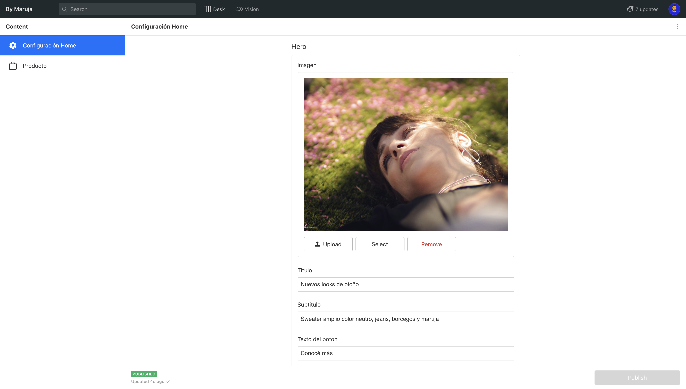

¿Hola chicos, que hay? Han pasado algunas semanas desde que hablamos sobre este proyecto, por lo que podrían estar pensando que el proyecto se derrumbó, déjenme decirles que eso está lejos de suceder.

Hemos estado trabajando muy duro y haciendo un buen progreso en algunos fundamentos que nuestra aplicación necesita cubrir. Hoy les mostraré cómo usamos todo el poder de [Sanity](https://www.sanity.io/) para **hacer que nuestra página de inicio sea configurable y cargar imágenes de una manera bastante genial**, así que sin más preámbulos, vamos a eso.

---

## Los requisitos

Cada sitio web debe tener una página de inicio, por suerte para nosotros, nuestro equipo de diseño nos proporcionó diseños muy pulidos usando Figma que nos permitió verificar todo más rápido y estar siempre sincronizados. Se ve algo como esto:


Adjuntos a este diseño, los primeros requisitos comenzaron a aparecer.

- **Hacer la página de inicio configurable.**
- **Todas las imágenes deben cargarse de manera eficiente.**

Esos son grandes desafíos, pero [Sanity](https://www.sanity.io/) proporciona todo lo que necesitamos para implementarlos.

## Hacer una página configurable

Aquí lo que vamos a hacer es hacer algún tipo de esquema en [Sanity](https://www.sanity.io/) que permitirá al usuario definiar las propiedades de configuración, elegir las imágenes, el texto y hacer que nuestra página de inicio tenga todo lo que necesita para renderizar desde esa configuración.

Primero, definiremos 3 esquemas, uno para la `home`, uno para el `hero` y otro para las `categories`.
Para la página de inicio, comenzamos definiendo el título de la página de inicio, una propiedad del tipo `hero` y una propiedad del tipo `array de category`

```javascript
export default {
  name: "homeSettings",
  type: "document",
  title: "Home sections",
  __experimental_actions: [/*'create',*/ "update", /*'delete',*/ "publish"],
  fields: [
    {
      title: "TituloPagina",
      name: "homePageTitle",
      type: "string",
      readOnly: true,
      hidden: true,
    },
    {
      title: "Hero",
      name: "hero",
      type: "hero",
    },
    {
      title: "Categorias",
      name: "categories",
      type: "array",
      of: [{ type: "category" }],
    },
  ],
  initialValue: () => ({
    homePageTitle: "Configuración Home",
  }),
}
```

Para el `hero` definimos la imagen, el título, el subtítulo, el texto en el botón y la URL del botón.

```javascript
export default {
  name: "hero",
  type: "document",
  title: "Hero",
  __experimental_actions: [/*'create',*/ "update", /*'delete',*/ "publish"],
  fields: [
    {
      title: "Imagen",
      name: "image",
      type: "image",
      options: {
        metadata: ["lqip"],
      },
    },
    {
      title: "Titulo",
      name: "title",
      type: "string",
    },
    {
      title: "Subtitulo",
      name: "subtitle",
      type: "string",
    },
    {
      title: "Texto del boton",
      name: "buttonText",
      type: "string",
    },
    {
      title: "Url del boton",
      name: "buttonURL",
      type: "string",
    },
  ],
}
```

Finalmente, definimos un tipo llamado `category` que usaremos para hacer una lista de categorías que sea dinámica y editable.

```javascript
export default {
  name: "category",
  type: "document",
  title: "Categoria",
  __experimental_actions: [/*'create',*/ "update", /*'delete',*/ "publish"],
  fields: [
    {
      title: "Imagen",
      name: "image",
      type: "image",
      options: {
        metadata: ["lqip"],
      },
    },
    {
      title: "Nombre",
      name: "name",
      type: "string",
    },
  ],
}
```

Como cereza del postre, hacemos algunas modificaciones en cómo Sanity muestra los tipos dentro del `studio`:

```javascript
import S from "@sanity/desk-tool/structure-builder"
import { MdSettings } from "react-icons/md"

export default () =>
  S.list()
    .title("Content")
    .showIcons()
    .items([
      S.listItem()
        .title("Configuración Home")
        .child(
          S.document()
            .schemaType("homeSettings")
            .documentId("homeSettings")
        )
        .icon(MdSettings),
      // Add a visual divider (optional)
      S.divider(),
      // List out the rest of the document types, but filter out the config type
      ...S.documentTypeListItems().filter(
        listItem =>
          !["homeSettings", "hero", "category"].includes(listItem.getId())
      ),
    ])
```

Con esto obtenemos el siguiente resultado:




Como puedes ver, **obtenemos una interfaz de usuario agradable con la capacidad de configurar todos los datos que queremos que use nuestro sitio, manteniendo un modelo separado para nuestros productos**. Esto también se ocupa del hecho de que solo podemos definir una configuración, no hay forma de crear un documento de inicio adicional.

Entonces, ¿cómo usamos esto en nuestro sitio web? si recuerdas nuestro episodio anterior, logramos llevar los productos de [Sanity](https://www.sanity.io/) al sitio web simplemente haciendo una consulta con el cliente JavaScript de [Sanity](https://www.sanity.io/), no hay diferencia aquí aunque la consulta es un poco más complicada.

Desde nuestra aplicación Next.js hacemos lo siguiente:

```javascript
export const getServerSideProps = async () => {
  const sanityResult = await sanity.fetch(
    `
    *[_type == "homeSettings"][0]{
      categories[] {   	  
        ...,
         "asset": image.asset-> {
            url,
            metadata 
         }
      },
       hero {
           ...,
         "asset": image.asset-> {
            url,
            metadata 
         }
       }
     }
  `
  )

  return { props: { ...sanityResult } }
}
```

Recuperamos todo el modelo `homeSettings`, observemos cómo estamos transformando las imágenes en un tipo de dato especial llamado [Asset](https://www.sanity.io/help/asset-metadata-field-invalid), será volvera claro por qué hacemos esto cuando nos encarguemos del siguiente requisito.

A partir de aquí, solo creamos una aplicación de React normal que usa esos valores para mostrar las imágenes y el texto, tan pronto como el administrador cambie algo de sanity studio, los cambios se reflejarán automáticamente en nuestro sitio web. Por cierto, si deseas verificar cómo estamos progresando, puedes consultar la implementación de nuestra master branch [aquí](https://by-maruja.now.sh/).

## Cargando imágenes de la manera correcta

Este es un tema complicado, hay toneladas de artículos y enfoques sobre cómo se deben cargar imágenes en un sitio web, hoy consideraremos dos problemas y veremos cómo implementamos las soluciones usando Sanity.

Lo primero que queremos considerar es que **para imágenes como la del `hero`, estas pueden ser súper grandes, lo que hará que nuestro sitio web se cargue muy lentamente. El enfoque estándar para este problema sería cargar la misma imagen en 3 tamaños diferentes y cargar cada una cuando sea apropiado.**

Este es un buen enfoque, pero en realidad, no podemos esperar que el usuario lidie con todas esas molestias. Afortunadamente, Sanity nos proporciona transformaciones de imagen directamente desde su API, puedes ir [aquí](https://www.sanity.io/docs/image-urls) si deseas leer más sobre el tema.

Pero, ¿qué significa esto para nosotros? muy simple, al ejecutar métodos desde el cliente JavaScript de Sanity podemos hacer que Sanity se ocupe del problema de proporcionar el tamaño de imagen correcto, solo tenemos que encargarnos de cargar la imagen con la mayor resolución que queramos admitir y después de eso Sanity se encargara de todo por nosotros. Veamos como.

En nuestro tag de imagen regular, definimos un `srcset` para proporcionar imágenes responsive, pero en lugar de tener los 3 archivos diferentes, pedimos 3 anchos diferentes al cliente Sanity.

```javascript
 srcSet={`
     ${builder.image(image).auto('format')?.width(600)} 600w,
     ${builder.image(image).auto('format')?.width(1000)} 1000w,
     ${builder.image(image).auto('format')} 2000w
`}
```

Súper fácil ¿verdad? Tal vez te preguntes, de qué se trata ese `auto('format')`, esa es otra gran cosa que podemos hacer con Sanity.

No podemos esperar que el usuario cargue la imagen en un formato que sea bueno para nuestro sitio web, por lo que al incluir esa llamada, si el navegador admite `webp`, devolverá la imagen usando ese formato, que es el mejor para la web .

¿Es suficiente? bueno, pensemos en ello por un minuto. Ahora las imágenes se cargarán dependiendo de la resolución que tengamos en el dispositivo, lo cual es excelente, pero aún estamos lidiando con el hecho de que **si la conexión a Internet es lenta, las imágenes tardarán una eternidad en cargarse** y la interfaz de usuario tardará años en cargarse y lucira raro mientras carga.

Para resolver este problema, hay dos cosas que podemos hacer, la primera es **Lazy Loading**. Esto significa que las imágenes se solicitarán a Sanity solo cuando las necesitemos. **Si la imagen no se ve en el viewport entonces, no se bajaran las imágenes**.

Para implementar esto, hay dos opciones, puedes hacer tu propio componente o usar una biblioteca como [React Lazy Loading Image Component](https://www.npmjs.com/package/react-lazy-load-image-component). En nuestro caso, todavía no hemos decidido si la biblioteca cubre todas nuestras necesidades asi que estamos manteniendo ambas implementaciones hasta estar seguros.
Con estos cambios, nuestras categorías de productos solo se cargarán una vez que nos desplazamos hacia abajo en nuestra página de inicio.

Finalmente, el último cambio que necesitamos es usar **Low Quality Image Placeholder (LQIP). Un LQIP es solo una versión borrosa muy pequeña de su imagen que se carga primero y se muestra inmediatamente mientras la real se carga en segundo plano. Cuando se carga la imagen real, se reemplaza el placeholder por la imagen real**. Esto permite que nuestro sitio web se vea bien mientras esperamos que se descarguen las imágenes.

Para eso, vamos a usar el `Asset` que mencionamos anteriormente. Sanity crea automáticamente un LQIP para nosotros como metadata de los asset de imagen. Lo único que tenemos que hacer es pedirlo al cliente y usarlo dentro de nuestro componente de imagen. Vamos a hacerlo:

```javascript
import { getImageAsset } from '@sanity/asset-utils';

src={getImageAsset(asset).metadata.lqip}
```

¿No me digas que no fue fácil? Veamos el resultado:


No se tu pero estoy super contento con el resultado &#128512;

---

Eso es todo, este fue un largo ejemplo práctico, así que quiero agradecerte mucho por quedarte conmigo hasta el final. Creo que te da una buena idea del tipo de cosas que puedes lograr usando un CMS como Sanity dentro de tu proyecto. Por cierto, tengo 0 afiliaciones con Sanity, pero tener este proyecto me está haciendo amar su increíble producto.

Si te gustó mi artículo y esta serie, por favor comparte y házmelo saber en los comentarios &#128512;
