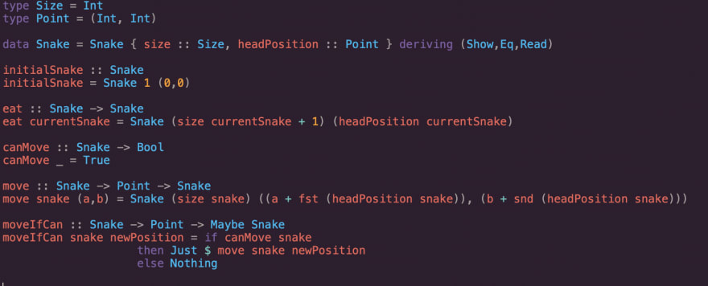
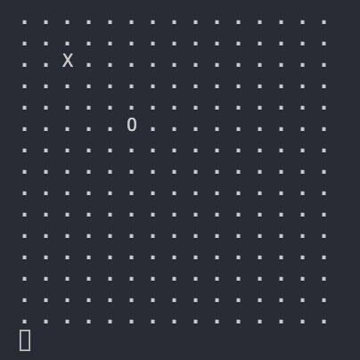

## Introducción

Si has estado siguiendo mis últimos artículos, probablemente sepas que he estado tratando de aprender programación funcional.
Al principio, estaba tratando de aprender `Haskell` leyendo este [libro](https://haskellbook.com/), aprendiendo Category Theory de este [libro](https://github.com/hmemcpy/milewski-ctfp-pdf/) e incluso tratando de construir un [Juego de la viborita](<https://en.wikipedia.org/wiki/Snake_(video_game_genre)>) en `Haskell`



Es justo decir que era miserable, estaba progresando muy poco y enfrentando cantidades increíbles de frustración, fue entonces cuando me di cuenta de que el problema era que estaba tratando de abordar demasiadas cosas a la vez.

Estaba:

1. ...**aprender** la sintaxis de Haskell
2. ...**aprender** programación funcional
3. ...**aprender** un nuevo IDE y herramientas de desarrollo.
4. ...**construir** un juego de la viborita.

Principalmente, lo que estaba sucediendo era que me atascaba constantemente debido a que no entendía cómo hacer cosas básicas (como escribir en la consola) o no sabía los nombres correctos para los patrones comunes en la programación funcional. Entonces, decidí cambiar mi enfoque. Fui a algo que sabía, `JavaScript`. No soy un experto pero lo uso todos los días, también tenía 2 libros y un curso preparados.

- [Mostly adequate guide to Functional Programming](https://mostly-adequate.gitbooks.io/mostly-adequate-guide/)

- [Functional-Light JavaScript](https://github.com/getify/Functional-Light-JS)

- [Functional-Light JavaScript V3 course on Frontend Masters](https://frontendmasters.com/courses/functional-javascript-v3/)

Después de repasarlos y hacer algunas prácticas sencillas, decidí asumir nuevamente el desafío de construir el juego, ahora en un lenguaje que conocía, por lo que si en algún momento me quedaba atrapado en la `forma funcional`, siempre podría volver al clásico `JavaScript`. En este tutorial, te guiaré mientras construyes el juego, pero toma esto no como un ejemplo perfecto sino como un diario de mis pasos en el `estilo funcional`.

---

Tomé la idea de este post de [la explicación de Christopher Okhravi](https://www.youtube.com/watch?v=poVMBGe1THE) y decidí que voy a crear este pequeño juego en múltiples lenguajes de programación funcionales para poder comprobar cuál me gusta mas y luego sumergirme en él. Primero, déjame aclarar que el contenido y la forma de explicar las cosas que tiene Christopher me parecen asombrosas, pero encontré dos problemas con este video:

1. Como yo no vengo de un `background` funcional, no podía seguir el código que él escribió o entender por qué había construido cosas de cierta manera, así que decidí tomar el asunto en mis propias manos, construirlo por mi cuenta para hacer una comparación más tarde.
2. Como no conozco los patrones comunes de la programación funcional, no podría lidiar con tener que construir las funciones básicas y al mismo tiempo construir el juego.

Para resolver ambos problemas, decidí utilizar [Ramda.js](https://ramdajs.com/docs/), esta libreria implementa muchas de las funciones que encontrarías en un lenguaje totalmente funcional, todas son `puras` y todas vienen `curried` por defecto.

---

Perdón por la larga presentación, quería explicar qué guió mis decisiones y cómo llegué a este punto. Empecemos.

En esta primera parte de la serie, intentaremos construir los 3 elementos básicos del juego: el mapa, la serpiente (representado por `X` 's), la manzana (representado por `O`) y mostrarlos en la consola . Entonces obtendremos algo como esto:



## Los fundamentos, un punto.

El mapa es una matriz bidimensional con coordenadas `X` e `Y`, llamaremos a este tipo un `punto` y lo definiremos de la siguiente manera:

```javascript
const point = (x, y) => {
  return {
    x: x,
    y: y,
  }
}
```

A partir de esto, podemos crear la `serpiente` que no es más que una colección de `puntos`, la `manzana` que es solo un`punto` en el `mapa`. Estas 2 cosas serán parte del `estado` de nuestro juego.

```javascript
/// Elegí una posición arbitraria para nuestra manzana y serpiente
const initialState = {
  snake: [point(2, 2)],
  apple: point(5, 5),
}
```

## Mostrando el mundo

En nuestro caso, la interfaz de usuario será el `terminal`. Queremos que este se desacople de la lógica de nuestro juego, así que dejamos el código anterior en un módulo llamado `snake.js` y creamos un nuevo módulo llamado `ui.js` donde podemos comenzar a crear el código que mostrará el `mapa`, la`serpiente` inicial y la `manzana` inicial.

### El mapa

Como dijimos antes, el `mapa` es solo una matriz bidimensional llena de `.`, ¿cómo podemos crear eso?

Importamos `ramda`

```javascript
const r = require("ramda")
```

Creamos una función que recibe, el número de filas, el número de columnas y el `estado` inicial de nuestro juego (usaremos ese `estado` más adelante para dibujar la `manzana` y la `serpiente` por encima del `mapa`).

```javascript
const createWorld = (rows, columns, state) => {
  // Creamos una función que creará una matriz de cierta longitud
  // con el '.' en cada elemento aplicando parcialmente ramda.repeat
  const repeatDot = r.repeat(".")

  // creamos una matriz con la longitud de `columns`,
  // luego lo mapeamos y para cada elemento insertamos una nueva matriz
  // con la longitud de las `row` toda cubierta de puntos.
  return r.map(r.thunkify(repeatDot)(rows), repeatDot(columns))
}
```

### La manzana

Continuemos con la `manzana` ya que es solo un `punto`. Podríamos comenzar haciendo esto:

```javascript
const addApple = (state, map) => {
  map[state.apple.x][state.apple.y] = "0"

  return map
}
```

La función recibiría el `mapa`, el `estado` y agregaría una `O` en la posición en que debería estar la `manzana`. Esto funciona, pero sé que no es "muy funcional" ya que estoy mutando una matriz en su lugar. En cambio, podríamos usar una función llamada `adjust` que recibirá un _índice_, una _string_ y un _array_ y copiará esa _array_ pero reemplazará el elemento en el _índice_ por el _string_. Así que creemos una función auxiliar para actualizar nuestro `mapa`.

```javascript
// Esta función tomará una cadena y un punto, primero reemplazará a `X`
// coordenada de la matriz y luego reemplaza la `Y`.
const update = r.curry((str, point) =>
  r.adjust(
    point.y,
    r.adjust(point.x, () => str)
  )
)
```

Probablemente hayas notado algo extraño en esta función, no estamos pasando el `mapa` en ninguna parte, esto se debe a que estamos retrasando la evaluación de dicha función, en lugar de pasar el `mapa`, estamos devolviendo una función que recibirá el `mapa` y producirá un resultado , sé que esto se ve raro, pero la razon se hará evidente en un momento, confía en mí.
Ahora que tenemos la función auxiliar `update` podemos refactorizar nuestra función `addApple` de la siguiente manera:

```javascript
const addApple = state => update("O")(state.apple)
```

Nuestra función `addApple` tomará el `estado`, llamará a la función `update` y devolverá la función que hará el trabajo cuando le pasemos el `mapa`.
Entonces, intentemos dibujar la `manzana`, para eso, yo lo imagino como una línea de montaje. Primero, creamos el `mapa`, luego dibujamos la `manzana` por encima, por lo que haremos uso de una función muy común en la Programación Funcional llamada `pipe`.

```javascript
const createWorld = (rows, columns, state) => {
  const repeatDot = r.repeat(".")
  const map = r.map(r.thunkify(repeatDot)(rows), repeatDot(columns))

  return r.pipe(addApple(state))(map)
}
```

Con pipe lo que hacemos es configurar una serie de funciones que se ejecutarán una tras otra, pasando el valor de retorno de cada una a la siguiente función. Esto parece más o menos lo que queremos hacer, ¿verdad? primero, dibuja el `mapa`, luego dibuja la `manzana` por encima y finalmente dibuja la `serpiente`.

### La serpiente

Entonces, ahora que tenemos una forma de dibujar por encima del `mapa`, extendamos eso para dibujar la `serpiente`

```javascript
const addSnake = state => r.pipe(...r.map(update("X"), state.snake))
```

Entonces, ¿que hacemos aqui? bueno, estamos creando una función que pondrá una `X` en cada posición de la `serpiente` y luego devolverá todos esos cambios en forma de una sola función aplicando parcialmente `pipe`. Cuando esa función se ejecute y reciba el `mapa` hará todos los cambios en una cadena. Ahora nuestro `createWorld` se verá así:

```javascript
const createWorld = (rows, columns, state) => {
  const repeatDot = r.repeat(".")
  const map = r.map(r.thunkify(repeatDot)(rows), repeatDot(columns))

  return r.pipe(addSnake(state), addApple(state))(map)
}
```

Ahora, ¿cómo podemos mostrar eso? creemos una función `displayWorld`

```javascript
const intercalate = r.curry((str, xs) => xs.join(str))

const displayWorld = matrix => {
  console.clear()
  console.log(intercalate("\r\n", r.map(intercalate(" "), matrix)))
}
```

Esta función no es nada mágica, solo toma el `mapa`, logea cada línea colocando un espacio entre cada elemento, y cuando llega al final hace un salto de línea. Extraje la lógica del intercalado a una función auxiliar para hacerlo más legible.

Finalmente, podemos juntar nuestro `estado` inicial y mostrarlo en la consola

```javascript
const display = (rows, columns, state) => {
  return r.pipe(createWorld, displayWorld)(rows, columns, state)
}

display(15, 15, Snake.initialState)
```


## Conclusiones

Lo sé, realmente necesitamos que alguien trabaje en los gráficos si vamos a intentar vender este juego, ¿verdad?

Espero que este ejemplo no haya sido demasiado difícil para ustedes, hice todo lo posible para explicar mi proceso de pensamiento al crear la 'UI'.

En la siguiente publicación, trataremos de cubrir toda la lógica para mover la `serpiente`, comer la `manzana`, reiniciar el juego y perder.

Si te gustó este artículo, no olvides compartir o comentar, si tienes alguna duda sobre el código, no dudes en preguntarme en los comentarios. También puedes consultar el código fuente [aquí](https://github.com/Raagh/functional-snake-game) &#128512;.
