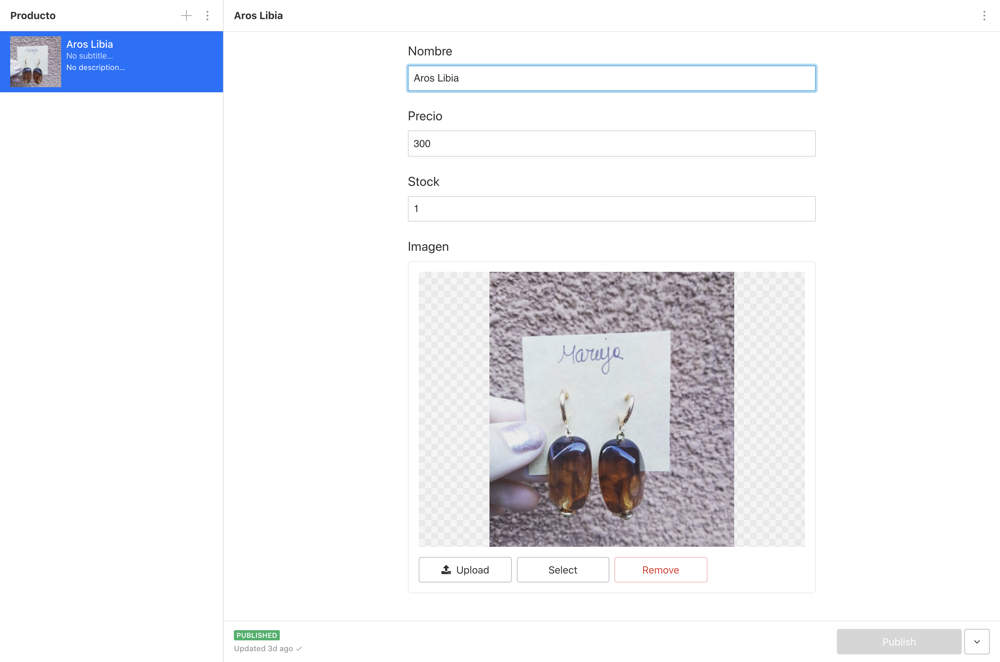
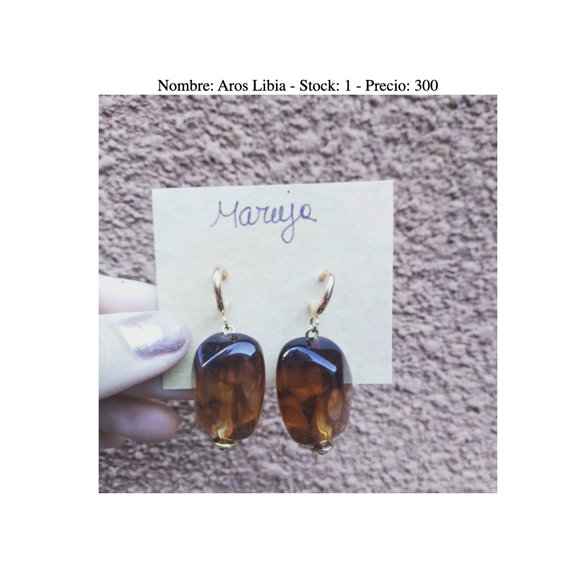
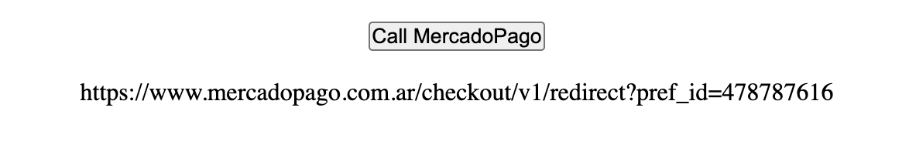

¿Hola chicos, que hay? Como parte del equipo de desarrollo de Maruja, hemos estado trabajando muy duro para hacer realidad el proyecto que analizamos en el último artículo, por cierto, si no has leído el primer artículo, te sugiero que comiences con ese porque hoy vamos a profundizar en la implementación.

Comenzaremos **configurando el proyecto de Next.js y la integración básica con Sanity y MercadoPago**. Entonces, sin más preámbulos, comencemos.

---

## La puesta en marcha

Como mencioné en la primera parte, decidimos usar el siguiente stack:

- [Next.js](https://nextjs.org/)
- [TypeScript](https://www.typescriptlang.org/)
- [Styled Components](https://styled-components.com/)
- [Jest](https://jestjs.io/) + [Enzyme](https://enzymejs.github.io/enzyme/) for testing
- [Sanity.io](https://www.sanity.io/)
- [MercadoPago](https://www.mercadopago.com.ar/)
- [Vercel/Now.sh](https://vercel.com/)

Afortunadamente, la configuración inicial es bastante sencilla, creamos una aplicación de Next con el siguiente comando:

```shell
npm init next-app by-maruja-ecommerce
```

Esto creará el siguiente proyecto de inicio, sin ninguna de las plantillas que trae Next.js. Después de eso, agregar TypeScript es pan comido, instalamos los TypeScript y los tipos de Node.js:

```shell
npm install --save-dev typescript @types/react @types/node
```

Y creamos un archivo `tsconfig.json` vacío:

```shell
touch tsconfig.json
```

Después de eso, si iniciamos la aplicación, el `tsconfig.json` será completado por nosotros y todo estará listo para funcionar. Instalar styled-components también es bastante sencillo, solo un comando:

```shell
npm install styled-components babel-plugin-styled-components @types/styled-components
```

Con Jest and Enzyme es donde las cosas se ponen un poco más complejas, por suerte siempre hay alguien que lo ha hecho antes que tú, y encontré [este gran artículo de Halil Kayer que me funcionó como por arte de magia](https://medium.com/@kjaer/setting-up-jest-and-enzima-para-typecript-next-js-apps-ce383167643).

Ahora viene la parte divertida, **las integraciones**.

## Sanity.io

Sanity tiene muy buena documentación e incluso algunos proyectos de ejemplo que usan Next.js, me referiré a un artículo en la página de Sanity que fue muy útil para crear el servicio y el Sanity Studio, puedes leerlo [aquí](https://www.sanity.io/blog/build-your-own-blog-with-sanity-and-next-js).

Después de crear el Studio y tener instalada la biblioteca de cliente de Sanity en nuestro proyecto, procedemos a crear nuestro primer esquema, **el producto**.

```javascript
import { BsBag } from "react-icons/bs"

export default {
  title: "Producto",
  icon: BsBag,
  name: "product",
  type: "document",
  fields: [
    {
      title: "Nombre",
      name: "name",
      type: "string",
    },
    {
      title: "Precio",
      name: "price",
      type: "number",
    },
    {
      title: "Stock",
      name: "stock",
      type: "number",
    },
    {
      title: "Imagen",
      name: "image",
      type: "image",
    },
  ],
}
```

Como puedes ver aquí, **definimos todas las propiedades que tendrá un producto en nuestro Sanity Studio. Nombre, precio, stock e imagen**, incluso el icono del menú usa 'react-icons' que viene por defecto con Sanity. Nuestro Studio se ve así:



La interfaz de usuario es súper simple y fácil de usar, **con nuestro esquema definido podemos crear múltiples productos y almacenarlos en Sanity**, en los siguientes artículos recuperaremos la lista de productos para mostrar nuestro catálogo en nuestro sitio web.

Por ahora, solo crearemos una pequeña prueba en nuestra página Index:

```jsx
const Index = (product: Product) => {
  const [buttonText, setButtonText] = useState("")

  return (
    <Layout>
      <Container>
        <Main>
          <p>
            Nombre: {product.name} - Stock: {product.stock} - Precio:{" "}
            {product.price}
          </p>
          
        </Main>
      </Container>
    </Layout>
  )
}

Index.getInitialProps = async () => {
  return sanity.fetch(
    `
    *[_type == "product"][0]
  `
  )
}
```

**En este ejemplo, solo recuperamos el primer producto (el único que tenemos actualmente) usando el lenguaje de consulta de Sanity (también puedes usar GraphQL), lo pasamos a nuestro componente de React que representa nuestra página Index y mostramos el nombre, el stock y precio dentro de un párrafo**.

**Luego, cargamos la imagen**. Para esto Sanity tiene una gran biblioteca que hará el trabajo por nosotros, primero ejecutamos el siguiente comando:

```shell
npm install @sanity/image-url
```

Y luego agregamos el siguiente código:

```jsx
import imageUrlBuilder from "@sanity/image-url"
import { SanityImageSource } from "@sanity/image-url/lib/types/types"

const builder = imageUrlBuilder(sanity)

export const urlFor = (source: SanityImageSource) => builder.image(source).url()
```

Después de algunos estilos para que tenga el tamaño adecuado, nuestra página se ve así:



Muy bien, ¿verdad? **el cliente de Sanity incluso tiene algunas funciones y propiedades que puedes usar para crear imágenes con el tamaño correcto sobre la marcha**, probablemente tendremos que lidiar con eso en los siguientes artículos.

## MercadoPago

Construir la integración con MercadoPago no fue tan fácil como esperaba, aunque la [Referencia de API](https://www.mercadopago.com.ar/developers) es bastante buena, carece de ejemplos y no hay ningún tipo de @types para obtener cierta compatibilidad con TypeScript en el [SDK oficial de MercadoPago JavaScript](https://www.mercadopago.cl/developers/es/guides/sdks/official/js/).

Después de algunas horas de buscar un ejemplo, mirando otros proyectos de código abierto que usan el servicio y "logeando" muchas cosas, seguí adelante e hice una pequeña definición de tipos para cubrir los metodos que vamos a usar para generar el enlace de pago. Con este enlace vamos a redirigir al usuario a la plataforma de MercadoPago para que se pueda procesar el pago.

```typescript
declare module "mercadopago" {
  export function configure(options: ConfigureOptions)
  export const preferences: Preferences

  export interface ConfigureOptions {
    client_id?: string
    client_secret?: string
    access_token: string
    sandbox?: boolean
    show_promise_error?: boolean = true
  }

  export interface PaymentItem {
    title: string
    description: string
    quantity: number
    currency_id: Currencies
    unit_price: number
    picture_url?: string
  }

  enum Currencies {
    ARS = "ARS",
  }

  export interface MercadoPagoResponse {
    response: {
      init_point: string
      sandbox_init_point: string
    }
  }

  export interface MercadoPagoPaymentRequest {
    items: PaymentItem[]
    back_urls?: {
      success: string
      pending: string
      failure: string
    }
    auto_return?: string
    external_reference: string
    expires: boolean
  }

  export interface Preferences {
    schema: {
      additionalProperties: false
      properties: PaymentRequest
    }
    partnersHeaders: true
    create: (data: MercadoPagoPaymentRequest) => MercadoPagoResponse
    save: Function
    update: Function
    get: Function
    findById: Function
  }
}
```

Después de definir esos tipos, seguímos adelante y creamos la [ruta API Next.js](https://nextjs.org/docs/basic-features/typescript#api-routes) que usaremos en nuestra aplicación para llamar a MercadoPago cuando se desea proceder con el pago. Definimos un pequeño servicio que funcionará como una capa entre la biblioteca del cliente de MercadoPago y nuestro código:

```typescript
import { configure, MercadoPagoPaymentRequest, preferences } from "mercadopago"

export function configureMercadoPagoSDK() {
  configure({
    access_token: process.env.mercadoPagoAccessToken,
  })
}

export const createPreferenceLink = async (data: MercadoPagoPaymentRequest) =>
  preferences.create(data)
```

Y lo llamamos desde nuestra ruta API:

```typescript
import { NextApiRequest, NextApiResponse } from "next"
import {
  configureMercadoPagoSDK,
  createPaymentLink,
} from "../../lamda-services/mercadopago.service"

export default async (req: NextApiRequest, res: NextApiResponse) => {
  configureMercadoPagoSDK()

  const result = await createPaymentLink(req.body)?.init_point
  res.json(result)
}
```

Después de eso, simplemente agregamos un botón y un párrafo y hacemos una llamada a nuestra ruta API desde nuestro Index. Nuestro código se ve así:

```jsx
const Index = (product: Product) => {
  const [buttonText, setButtonText] = useState("")

  const contactCreatePayment = () => {
    axios
      .post("/api/create-payment", paymentDataRequest)
      .then(result => setButtonText(result.data))
  }
  return (
    <Layout>
      <Container>
        <Main>
          <p>
            Nombre: {product.name} - Stock: {product.stock} - Precio:{" "}
            {product.price}
          </p>
          
          <button type="button" onClick={contactCreatePayment}>
            Call MercadoPago
          </button>
          <br />
          <p id="buttonText">{buttonText}</p>
        </Main>
      </Container>
    </Layout>
  )
}
```

¿Y cuando hacemos clic en el botón en la pantalla? Voilà



En los siguientes artículos, crearemos componentes reales y comenzaremos a construir la interfaz de usuario para nuestro sitio web.

---

Wow, eso fue mucho para asimilar, lo siento si fue una introducción dura, desafortunadamente, un artículo no es suficiente para guiarte en cada paso, como configurar ESLINT para TypeScript o agregar los estilos con styled-components. Si deseas ver un curso o un video tutorial donde veamos cada paso de la construcción de un proyecto, hágamelo saber en los comentarios a continuación y considera subscribirte a mi newsletter al final de este artículo, esa será la mejor manera de contactarte cuando eso suceda &#128512;

Si te gustó este artículo y cómo va la serie hasta ahora, compártelo.
