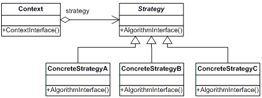
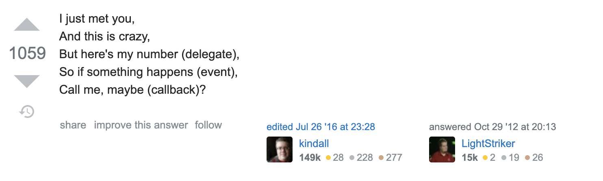

## Introducción

Desde finales del año pasado, me estoy metiendo en la Programación Funcional (FP), todavía soy muy malo en eso.

Encuentro algunos conceptos muy difíciles de entender, las cosas todavía se sienten muy poco naturales, pero a lo largo de este proceso, comencé a notar algunas cosas que hacemos regularmente en la programación orientada a objetos (OOP) que son mucho más fáciles de implementar en lenguajes de programación funcionales, requieren menos código y, a veces, la implementación viene por defecto proporcionada por el propio lenguaje.

En un artículo anterior, hablé sobre cómo se aplican los principios SOLID a FP, puedes leerlo [aquí](https://www.patferraggi.dev/blog/2020/jul/solid-funcional/), hoy voy a hacer un análisis similar pero con respecto a los Patrones de Diseño, específicamente algunos de los se mencionan en el [libro GoF original](https://www.amazon.com/Design-Patterns-Object-Oriented-Addison-Wesley-Professional-ebook/dp/B000SEIBB8)

---

### Strategy Pattern

Comencemos con la definición original:

> El patrón de estrategia es un patrón de diseño que permite seleccionar un algoritmo en tiempo de ejecución. En lugar de implementar un solo algoritmo directamente, el código recibe instrucciones en tiempo de ejecución sobre cuál usar.

La estrategia permite que el algoritmo varíe independientemente de los clientes que lo utilicen.

¿Como se ve esto?



En los lenguajes de programación orientada a objetos, esto generalmente implica clases separadas para cada estrategia y todas implementan una interfaz común, luego otra clase hace uso de la interfaz de estrategia sin saber realmente qué implementación de estrategia se ha seleccionado en tiempo de ejecución, con esto separamos las responsabilidades de seleccionar el algoritmo y las diferencias en la implementación entre estrategias teniendo la posibilidad de seleccionar una u otra durante el tiempo de ejecución.

En FP, este patrón se vuelve extremadamente fácil de implementar y requiere mucho menos código. Voy a usar JavaScript, pero puede ser igualmente fácil de implementar en lenguajes completamente funcionales.

```javascript
const strategy1 = () => {
  console.log("run strategy 1")
}

const strategy2 = () => {
  console.log("run strategy 2")
}

const consumer = runStrategy => {
  /*
  Hacemos otras cosas
  */

  runStrategy()
}

const selectedStrategy = condition ? strategy1 : strategy2

consumer(selectedStrategy)
```

Como puedes ver, en FP, el patrón de estrategia se vuelve tan simple como pasar una función como parámetro. Hay mucho menos código involucrado porque no tenemos que depender de clases o herencia para lograr la misma funcionalidad.

### Factory Pattern

> El patrón de fábrica es un patrón que utiliza métodos para lidiar con el problema de crear objetos sin tener que especificar la clase exacta del objeto que se creará. Esto se hace creando objetos llamando a un método de fábrica, ya sea especificado en una interfaz e implementado por clases secundarias, o implementado en una clase base y opcionalmente anulado por clases derivadas, en lugar de llamar a un constructor.

En los lenguajes de programación orientada a objetos, esto generalmente implica clases separadas que encapsulan la lógica de negocio referida a la creación de objetos y que pueden decidir qué objeto crear durante el tiempo de ejecución. Esto a menudo implica establecer parámetros específicos en el objeto creado dependiendo de lo que queramos instanciar.

En FP, este patrón se vuelve extremadamente fácil de implementar:

```javascript
const behavior1 = () => {
  console.log("do behavior 1")
}

const behavior2 = () => {
  console.log("do behavior 2")
}

const factory = condition => {
  /*
  Do other stuff
  */

  if (condition) behavior1

  return behavior2
}
```

Como puedes ver, las funciones de orden superior nos dan una solución simple nuevamente, en lugar de que el comportamiento sea definido por clases y una herencia, simplemente devolvemos una función que encapsula el comportamiento u objeto deseado.

### Decorator Pattern

> El patrón de decorador es un patrón de diseño que permite agregar comportamiento a un objeto individual, de forma dinámica, sin afectar el comportamiento de otros objetos de la misma clase. El patrón de decorador suele ser útil para adherirse al principio de responsabilidad única, ya que permite dividir la funcionalidad entre clases con áreas de interés únicas.

En los lenguajes de programación orientada a objetos, se envuelve un objeto en otro y proporcionamos una funcionalidad adicional que el original no tenía, sin modificar realmente su implementación, además, puedes elegir en tiempo de ejecución qué funcionalidad necesita agregar al objeto existente.

En FP esto se logra mediante `Composición`, una de las ideas centrales de FP es separar la funcionalidad en pequeñas funciones que se pueden componer para formar otros comportamientos, por lo que en lugar de tener una clase que envuelva a otra, tomamos pequeñas funciones como bloques `LEGO` y los ponemos todos juntos para crear un nuevo comportamiento. Veamos un ejemplo:

```javascript
const compose = (...fns) => x => fns.reduceRight((v, f) => f(v), x)

function isBiggerThanThree(value) {
  return value > 3
}

function mapBoolToHumanOutput(value) {
  return value ? "yes" : "no"
}

const biggerThanThreeAndMapOutput = compose(
  mapBoolToHumanOutput,
  isBiggerThanThree
)

biggerThanThreeAndMapOutput(3)
```

En este ejemplo, definimos dos funciones que hacen una pequeña cosa y luego se componen para generar un nuevo comportamiento, mientras se aplique la composición, podemos seguir agregando más funcionalidad a la mezcla &#128512;

### Observer Pattern

> El patrón de observador es un patrón de diseño de software en el que un objeto, llamado sujeto, mantiene una lista de sus dependientes, llamados observadores, y les notifica automáticamente de cualquier cambio de estado, generalmente llamando a uno de sus métodos.

Este patrón se basa en la idea de Push vs Pull. En lugar de que un objeto compruebe constantemente si el estado de otro ha cambiado, el segundo objeto notifica a todos los demás cuando su propio estado ha cambiado.

En FP, este es un patrón muy utilizado en forma de `Callbacks`, `Events` y `Observers` . También se utilizan mucho en bibliotecas como [RX.js](https://rxjs.dev/) para `Programación funcional reactiva`

Me referiré a una respuesta a "¿Qué son las Callback?" en Stack Overflow.



### Singleton Pattern

> El patrón singleton es un patrón de diseño de software que restringe la instanciación de una clase a una instancia "única". Esto es útil cuando se necesita exactamente un objeto para coordinar acciones en todo el sistema. El término proviene del concepto matemático de singleton.

En los lenguajes de programación orientada a objetos, esto implica crear una instancia estática de un objeto para que esté disponible en todas partes sin instanciación y asegurarse de que si alguien intenta instanciarlo nuevamente, se devuelva la instancia ya creada.

En FP, este patrón se vuelve completamente innecesario, no hay un estado global que deba exponerse a toda la aplicación, ya que los datos están completamente separados de las funciones. Además, todas las funciones existen en un namespace global, siempre son accesibles, toman parametros y devuelven un resultado sin afectar el mundo exterior.

## Conclusión

Como puedes ver, parece que algunos de los patrones que han evolucionado dentro del mundo de OOP parecen dar a estos lenguajes los beneficios que FP obtiene de forma gratuita, sin perder las cosas que caracterizan a OOP como el control sobre el estado y los datos.

Hay algunos otros patrones que no mencioné porque encajan en las soluciones propuestas por los ejemplos anteriores.

---

A medida que continúe en mi viaje hacia la programación funcional, probablemente encontraré más ejemplos y casos que se ajusten a esta suposición mía. Si te gustó este artículo, házmelo saber en los comentarios para seguir escribiendolos.

Y por favor no olvides compartirlo &#128512;
