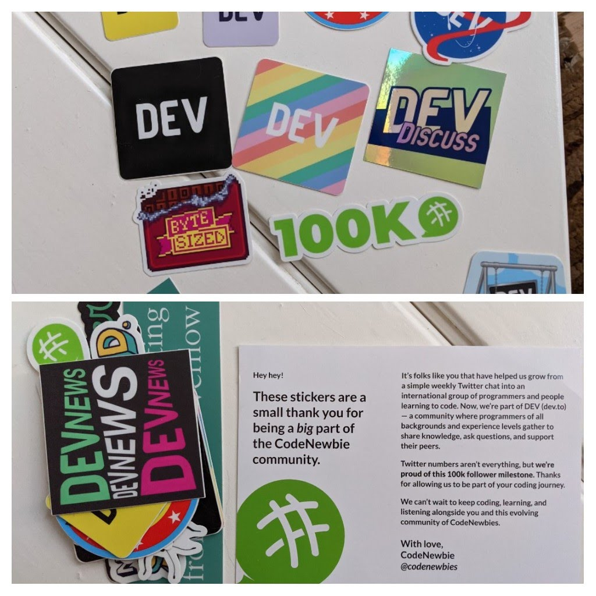

Hola chicos, ¡el 2021 finalmente está aquí!. Ha sido un año duro pero ahora es el momento de volver a planificar todo, de anotar en un papel lo que quiero aprender o hacer este año.

Si has estado siguiendo las publicaciones de mi blog durante algún tiempo, sabras que soy un gran fanático de establecer metas, planificar, trackear y, por supuesto, HACER.

El año pasado me concentré en demasiadas cosas y aunque logré bastantes de las cosas que me propuse, también noté que la presión de no alcanzar lo que esperaba me empujaba hacia atrás. Este año voy a ir un poco más ligero en la cantidad de cosas pero no en el esfuerzo, llamémoslo simplemente tener una dirección "mejor".

Empecemos ya, ¿de acuerdo?

-----

## 1. Sentirse cómodo escribiendo al menos en un lenguaje de programación funcional

El año pasado pasé bastante dando vueltas, yendo de libro en libro, buscando lenguajes, hablando con gente, haciendo pequeñas pruebas en diferentes entornos. Para este año he tomado la decisión de concentrarme en aprender `Haskell`, al menos al principio. Este será mi plan de estudios inicial:

- Leer el [Haskell Book](https://www.goodreads.com/book/show/25587599-haskell-programming-from-first-principles).
- Leer [A type of programming](https://atypeofprogramming.com/).
- Leer [Aprenda Haskell por el bien comun](http://learnyouahaskell.com/).
- Leer [Teoría de categorías para programadores](https://bartoszmilewski.com/2014/10/28/category-theory-for-programmers-the-preface/).
- Hacer al menos un proyecto personal de tamaño moderado con Haskell.
- Explorar otros lenguajes como Elm, PureScript, F#, Clojure.
- Leer [Programación funcional para el programador orientado a objetos](https://leanpub.com/fp-oo).
- Releer [Estructura e interpretación de programas informáticos](https://web.mit.edu/alexmv/6.037/sicp.pdf).

Al separar un gran objetivo en tareas más pequeñas y concisas, no necesito preocuparme por qué hacer a continuación, solo sigo el plan, si algo no va bien, resuelvo el problema y continúo.

## 2. Mejorar en arquitectura de software y la ciencias de la computación

El año pasado no me concentré en esto en absoluto, el año pasado tuve la idea de que quería aprender más sobre frontend, así que cambié de puesto en mi trabajo y me convertí en desarrollador frontend. Eso me enseñó que no estoy tan interesado en el frontend después de todo, jaja.

- Leer [La serie de manuales del impostor](https://bigmachine.io/products/the-imposters-handbook/).
- Leer y estudiar [Clean Architecture](https://www.amazon.com/-/es/Robert-C-Martin-ebook/dp/B075LRM681).
- Leer y estudiar [Domain Driven Design: Abordar la complejidad en el corazón del software](https://www.amazon.com/-/es/Eric-Evans/dp/0321125215).
- Leer y estudiar [Implementación de Domain Driven Design](https://www.amazon.com/-/es/Vaughn-Vernon/dp/0321834577).
- Asumir un proyecto en el trabajo donde pueda diseñar un sistema desde cero.
- Crear un proyecto personal utilizando los conceptos aprendidos, mientras se esquematiza la arquitectura.
- Participar en discusiones de arquitectura en mi nuevo puesto para aprender sobre sistemas distribuidos.

Comencé el año con una nueva posición, un nuevo trabajo como desarrollador de software senior en un lugar con algunas decisiones complejas y muchos sistemas geniales con los que jugar. Voy a aprovechar esta oportunidad para aprender todo lo que pueda de los nuevos miembros de mi equipo y, al mismo tiempo, intentaré aumentar mis propios conocimientos sobre el tema.

## 3. Mejorar la escritura

El año pasado escribí muchos blog posts, incluso algunas que me colocaron en la parte superior de la lista en comunidades increíbles como CodeNewbie, pero incluso asi no estoy conforme.

Empecé fuerte pero al final, la búsqueda de un nuevo trabajo y mis otros objetivos se interpusieron. Este año mi objetivo es tener menos cosas en las que concentrarme, ¡pero hacerlas con el máximo esfuerzo !.

- Planificar determinadas fechas durante la semana en las que voy a escribir.
- Tener una lista de temas sobre los que pueda escribir para poder elegir uno de la pila cuando llegue el momento.
- Escribir al menos 2 publicaciones de blog a la semana.
- Escribir sobre lo que estoy aprendiendo para solidificar conocimientos.

## 4. Mejorar mi participación en la comunidad

Este año me uní a una hermosa comunidad llamada [FrontendCafe](https://frontend.cafe/), gente increíble de Argentina y otros países de América Latina (y gente de España también &#128512;). Este año quiero seguir reuniéndome con desarrolladores de todo el mundo pero quiero dar especial atención a las personas de la comunidad hispanohablante, específicamente a aquellos que no tienen los medios para aprender cosas nuevas o que enfrentan algunos de los problemas que enfrenté cuando estaba comenzando en esta industria.

- Dar más mentorias en [FrontendCafe](https://frontend.cafe/) y fuera de la comunidad de habla hispana.
- Dedicar más tiempo a ayudar a nuevos usuarios y a utilizar mi rol como miembro del Staff en [FrontendCafe](https://frontend.cafe/).
- Ir a meetups (si vuelven).
- Dar una charla en una meetup local (si vuelven).

------

Como pueden notar algunas de las cosas son las mismas que ya dije en la planificación de 2020 y eso está bien. No alcancé el nivel que quiero alcanzar en muchos temas, así que este año me enfocaré aún más en ellos.
Otros temas han desaparecido por completo, eso también está bien. Después de 2020 aprendí algunas lecciones sobre mí mismo, sobre lo que me gusta y en qué temas quiero invertir más de mi tiempo.

Espero que les guste mi planificación para el 2021, si es así, compártela y escribelo a continuación en los comentarios. ¿Tienes un plan similar? Me gustaría leerlo, los comentarios también son el lugar perfecto para eso.

Hasta pronto &#128512;